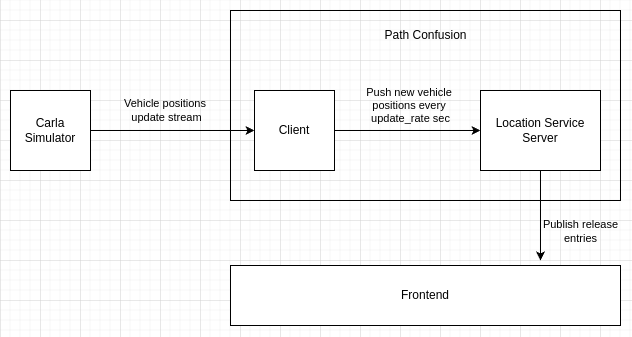

# Path cloaking algorithm

Implementation based on the algorithm described in the [paper by Hoh et al](https://doi.org/10.1109/TMC.2010.62).

> IMPORTANT:
> 
> Please consider the following while collecting data (not relevant when viewing recordings):
> When running Carla locally you may see that the simulation slows down significantly from time to time, cars will then
> stop driving. Restart the [traffic generation script](./../location_cloaking/utils/map/generate_random_traffic.py) if
> this happens, otherwise the algorithm will calculate wrong position predictions as it is unaware of such slowdowns.

## Structure

The path cloaking prototype consists of two modules:
1. The [client](./client), which corresponds to a set of cars driving around within the Carla simulator.
   It forwards the positions of vehicles to the server every `update_rate` seconds.
2. The [server](./server), a trusted party which runs the path cloaking algorithm at the end of every interval. 
   Based on the vehicle updates received in an interval it decides which updates can be released while ensuring that privacy
   is maintained. It additionally informs the frontend about any changes to settings or available recordings.

## Tech Stack

All modules are python applications, and they communicate via websockets.

## Setup

The path cloaking setup expects the following things:
1. An instance of Carla simulator running, with cars randomly driving around in it.
2. Each module should be running.

Following order should be followed when starting the path cloaking modules:
> Assumes that Carla is running and the [traffic generation script](./../location_cloaking/utils/map/generate_random_traffic.py) 
> is used to generate the required traffic.
1. Start the [location server](./server/server.py).
2. Start the [client](./client/simple_client.py).

## Terminology

`Store`: Used to keep relevant information such as:
 - `position_entries`: Contains all updates received from the client.
 - `release_entries`: Contains all information that was published so far (from every interval). A release entry contains data about a vehicle at a certain interval
   such as the location, uncertainty, a flag `is_in_release_set` such that the frontend can also display locations the 
   path cloaking algorithm would have not published, and more.

`AlgorithmData`: Contains for each vehicle latest information such as its predicted location, last confusion time, dependencies,
 neighbors, and more.

`Observer`: Observers receive algorithm data and can issue commands changing, e.g., algorithm settings but do not provide
vehicle updates. Common example is the frontend.

`Client`: Pushes vehicle updates, does not issue commands.

## Communication

### Client-Server

`MsgClientServerBatchedVehicleUpdate`: Provides a list of vehicle updates containing the Carla identifier, vehicle
speed and location. This update is provided every `update_reate` seconds.

### Observer-Server

`MsgObserverServerChangeSettings`: Observer (e.g., frontend) instructs the server to update the algorithm settings.
Changing the `update_rate` may mean that the store does not contain necessary vehicle updates (e.g., if captured before with a higher
`update_rate`). In this case the algorithm data and store will be emptied. If the new algorithm settings do not include
a change for the `update_rate` then algorithm data is emptied and newly computed according to the new settings.

`MsgObserverServerAddRecording`: Dumps the store position entries and settings to a file [stored locally](./storage).

`MsgObserverServerDeleteRecording`: Deletes a recording with the specified file name.

`MsgObserverServerLoadRecording`: Given a file name it loads the contents and disables running the path cloaking algorithm at every interval end.
Additionally, newly received vehicle updates from the client are ignored.

`MsgObserverServerReset`: Resets the store and algorithm data. Only available when not viewing a recording.

`MsgObserverServerGoLive`: Marks the end of viewing a recording. Resets the store and algorithm data, 
enables running the path cloaking algorithm at every interval end. New vehicle updates from the client are stored again.

`MsgObserverServerChangeRelevantVehicles`: Run the path cloaking algorithm with only a subset of vehicles available in the position entries store.
Only available when viewing a recording.

### Server-Observer/Client

`MsgServerObserverSettingsUpdate`: Informs all observers about a change in algorithm settings. Contains the new settings.

`MsgServerObserverAvailableRecordings`: Informs all observers about available recordings whenever a recording was added or deleted.

`MsgServerClientReleaseUpdate`: Contains all release entries for the new interval.

`MsgServerObserverVehicles`: Informs all observers whenever the relevant set of vehicles changes. See `MsgObserverServerChangeRelevantVehicles`.

`MsgServerActionComplete`: When a command is issued this messages confirms processing completion.
